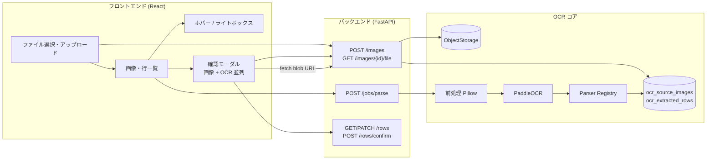

# OCR + 画像確認 UI 流用ガイド

> **目的**: 別ワークスペースの AI / 開発者が、VANZAI プロジェクトの「画像アップロード → OCR 解析 → 元画像と OCR 結果を並べて確認する UI」を理解し、同等の仕組みを再実装できるようにするための正本ドキュメント。
>
> **出典リポジトリ**: `VANZAI_project`（本ファイルと同梱のソースを参照）
>
> **最終更新**: 2026-07-14

---

## 1. このガイドで流用できるもの

| カテゴリ | 内容 | 汎用性 |
|---------|------|--------|
| **画像プレビュー UI** | ホバー拡大 + クリックでライトボックス | ★★★ 高（ドメイン非依存） |
| **確認モーダル UI** | 左: 元画像 / 右: OCR フィールド + 編集 + 確定 | ★★★ 高（フィールド定義だけ差し替え） |
| **認証付き画像取得** | API → blob URL → `` 表示 | ★★★ 高 |
| **OCR パイプライン骨格** | アップロード → 前処理 → PaddleOCR → パーサー → DB 行 | ★★☆ 中（エンジンは流用、パーサーは差し替え） |
| **マルチパス OCR** | 複数前処理 + 結果マージ | ★★☆ 中（画像種別ごとに調整） |
| **フィールド信憑性表示** | フィールド別 confidence バッジ | ★★☆ 中 |
| **公開アップロード + ジョブワーカー** | トークンリンク・非同期解析 | ★☆☆ 低（必要時のみ） |

**Paygate 固有のパーサー・フィールド名・照合ロジックは流用対象外。** 骨格と UI パターンを持ち込み、ドメイン知識（抽出フィールド・正規表現・レイアウト）は新プロジェクトで作り直す。

---

## 2. 全体アーキテクチャ



### 2.1 管理画面の典型フロー

1. ユーザーが画像を選択 → `POST /api/ocr/images` でアップロード
2. 「解析」→ `POST /api/ocr/jobs/parse`（同期、バッチ分割）
3. 抽出行一覧が表示される
4. 行をクリック → **確認モーダル**が開き、左に元画像・右に OCR フィールド
5. 誤りがあればインライン編集 → `PATCH /api/ocr/rows/{id}`
6. 問題なければ「確定」→ `POST /api/ocr/rows/confirm`

### 2.2 一覧でのクイック確認フロー

- サムネイルやファイル名にマウスオーバー → **ホバープレビュー**（portal 配置）
- クリック → **ライトボックス**（全画面）または確認モーダルへ

---

## 3. 技術スタック

### 3.1 バックエンド

| 項目 | 選定 |
|------|------|
| フレームワーク | FastAPI |
| OCR エンジン | **PaddleOCR 2.x**（`lang=japan`、CPU） |
| 前処理 | Pillow（OpenCV は依存にあるが前処理本体は Pillow） |
| DB | PostgreSQL + SQLAlchemy |
| 画像保存 | ローカル `ObjectStorage`（`OCR_STORAGE_ROOT`） |

**Python 依存**（`pyproject.toml` の `[project.optional-dependencies] ocr`）:

```toml
ocr = [
    "paddlepaddle>=2.6.0",
    "paddleocr>=2.7.0,<3.0.0",   # 3.x は API 非互換。2.x を使う
    "opencv-python-headless==4.10.0.84",
]
```

インストール: `pip install '.[ocr]'`

### 3.2 フロントエンド

| 項目 | 選定 |
|------|------|
| UI | React |
| データ取得 | TanStack Query（任意） |
| OCR 専用 npm | **なし**（ブラウザ OCR は使わない） |
| モーダル | `createPortal(..., document.body)` |

---

## 4. バックエンド実装パターン

### 4.1 ディレクトリ構成（参照用）

```
src/
  api/
    ocr_routes.py          # 認証付き OCR API
    public_ocr_routes.py   # 公開アップロード（任意）
  models/
    ocr.py                 # DB モデル
  services/
    ocr_service.py         # オーケストレーション
    document_storage.py    # ObjectStorage
    ocr/
      paddle_engine.py     # PaddleOCR ラッパー
      image_preprocess.py  # 前処理
      merge_results.py     # マルチパス結果マージ
      settlement_ocr.py    # 帯域別マルチパス（精算レシート向け）
      models.py            # OcrEngineResult, ParsedOcrRow 等
      parsers/
        base.py            # BaseOcrParser 抽象クラス
        registry.py        # source_type → Parser マップ
        paygate_*.py       # ★ドメイン固有（差し替え）
```

### 4.2 最小 API 契約（流用の核）

認証方式はプロジェクトに合わせてよい。以下は VANZAI の形。

| メソッド | パス | 用途 |
|---------|------|------|
| `POST` | `/api/ocr/images` | multipart: `file`, `source_type` |
| `GET` | `/api/ocr/images/{id}/file` | 画像バイナリ（`FileResponse`） |
| `POST` | `/api/ocr/jobs/parse` | JSON: `{ image_ids: string[] }` 同期解析 |
| `GET` | `/api/ocr/rows` | 抽出行一覧 |
| `PATCH` | `/api/ocr/rows/{id}` | 人手修正 |
| `POST` | `/api/ocr/rows/confirm` | JSON: `{ row_ids: string[] }` 確定 |

**画像取得 API が確認 UI の前提。** `` 直リンクではなく、認証ヘッダ付き `fetch` → `blob` → `URL.createObjectURL` をフロントで行う。

### 4.3 アップロード（重複検知付き）

```python
# src/services/ocr_service.py — upload_image の要点
sha256 = hashlib.sha256(file_bytes).hexdigest()
existing = session.execute(
    select(OcrSourceImage).where(OcrSourceImage.sha256 == sha256)
).scalar_one_or_none()
if existing:
    return existing, True  # 同一ファイルは再利用

storage_key = build_ocr_object_key(image_id, suffix)
storage.write_bytes(storage_key, file_bytes)
# OcrSourceImage を DB に INSERT（parse_status="pending"）
```

制限（VANZAI 既定）:
- 最大 10MB
- 拡張子: `.jpg`, `.jpeg`, `.png`, `.webp`, `.gif`

### 4.4 解析パイプライン

```python
# src/services/ocr_service.py — parse_images 内の分岐
image_bytes = storage.read_bytes(image.storage_key)

if image.source_type == "paygate_settlement":
    ocr_result = run_settlement_ocr(image_bytes)  # 帯域別マルチパス
else:
    ocr_result = run_ocr(preprocess_for_ocr(image_bytes))
    ocr_result = merge_ocr_results(
        ocr_result,
        run_ocr(preprocess_blue_amount_channel(image_bytes)),
        run_ocr(preprocess_upscaled_for_ocr(image_bytes)),
    )

parser = get_parser(image.source_type)
parsed_rows = parser.parse(ocr_result)
# → ocr_extracted_rows に保存（field_confidence は raw_payload に格納）
```

**新プロジェクトでは `source_type` と `Parser` を自分のドメイン用に追加するだけ。**

### 4.5 PaddleOCR ラッパー（そのまま流用可）

```python
# src/services/ocr/paddle_engine.py
_engine = None
_parse_lock = threading.Lock()  # プロセス内直列化

def run_ocr(image_array: np.ndarray) -> OcrEngineResult:
    with _parse_lock:
        engine = get_engine()  # PaddleOCR(lang="japan", use_gpu=False) lazy load
        raw = engine.ocr(image_array, cls=True)
    # → OcrEngineResult(lines=[OcrTextLine(text, confidence, box)], full_text)
```

環境変数 `OCR_ENGINE_DISABLED=1` でテスト時に無効化可能。

### 4.6 パーサー Registry パターン（拡張の要）

```python
# src/services/ocr/parsers/base.py
class BaseOcrParser(ABC):
    source_type: str

    @abstractmethod
    def parse(self, ocr_result: OcrEngineResult) -> list[ParsedOcrRow]:
        ...

# src/services/ocr/parsers/registry.py
PARSERS: dict[str, BaseOcrParser] = {
    "my_receipt_type": MyReceiptParser(),
    "my_screenshot_type": MyScreenshotParser(),
}

def get_parser(source_type: str) -> BaseOcrParser:
    parser = PARSERS.get(source_type)
    if parser is None:
        raise ValueError(f"Unsupported source_type: {source_type}")
    return parser
```

### 4.7 マルチパス OCR 結果マージ

```python
# src/services/ocr/merge_results.py
def merge_ocr_results(*results: OcrEngineResult) -> OcrEngineResult:
    # テキスト + 座標の粗いグリッドで重複排除し lines を結合
    ...
```

複数の前処理（通常・色チャンネル分離・アップスケール等）を走らせ、読み取り漏れを減らすパターン。

### 4.8 DB テーブル（最小セット）

| テーブル | 役割 |
|---------|------|
| `ocr_source_images` | アップロード画像メタ、`parse_status`, `storage_key`, `sha256` |
| `ocr_parse_jobs` | 解析ジョブ（同期/非同期共通） |
| `ocr_extracted_rows` | OCR 抽出行（確定前後の状態、修正履歴） |

マイグレーション参照:
- `alembic/versions/20260411a001_add_ocr_receipt_tables.py`
- `alembic/versions/20260616a001_add_ocr_row_confirm_metadata.py`

### 4.9 環境変数

| 変数 | 用途 | デフォルト |
|------|------|-----------|
| `OCR_STORAGE_ROOT` | 画像保存先 | `storage/ocr` |
| `OCR_ENGINE_DISABLED` | エンジン無効化 | 未設定=有効 |

同期解析は数分かかることがあるため、本番 nginx では `proxy_read_timeout` 延長が必要（`scripts/deploy/apply_nginx_ocr_timeout.sh` 参照）。

---

## 5. フロントエンド実装パターン（★確認 UI の核心）

### 5.1 ファイル構成（参照用）

```
apps/admin-web/src/
  pages/
    ReceiptOcrPage.tsx              # メイン画面（プレビュー UI はページ内コンポーネント）
  components/ocr/
    OcrSavedRowReviewModal.tsx      # ★ 確認モーダル（画像 + OCR 並列）
    OcrRowEditForm.tsx              # 行編集フォーム（モーダルと共有）
    OcrFieldConfidence.tsx          # 信憑性バッジ
  lib/
    api/client.ts                   # fetchOcrImageBlobUrl 等
    ocr/
      batchParse.ts                 # バッチ解析（タイムアウト・リトライ）
      rowDisplay.ts                 # 確定可否判定
      fieldConfidence.ts            # 信憑性色分け
  styles/global.css                 # .ocr-image-* / .ocr-row-review-* クラス
```

### 5.2 認証付き画像 blob URL 取得

**`` は使わない。** Cookie / Bearer トークンを付けた `fetch` が必要。

```typescript
// apps/admin-web/src/lib/api/client.ts
export async function fetchOcrImageBlobUrl(imageId: string): Promise<string> {
  const headers = new Headers();
  const token = getStoredAccessToken();
  if (token) headers.set("Authorization", `Bearer ${token}`);

  const response = await fetch(buildUrl(`/api/ocr/images/${imageId}/file`), { headers });
  if (!response.ok) throw new ApiError(response.status, "Image fetch failed");

  const blob = await response.blob();
  return window.URL.createObjectURL(blob);
}
```

### 5.3 画像 URL 用 React Hook

```typescript
// ReceiptOcrPage.tsx 内 — そのまま切り出して再利用可
function useOcrImageBlobUrl(imageId: string) {
  const [url, setUrl] = useState<string | null>(null);
  const [failed, setFailed] = useState(false);

  useEffect(() => {
    let active = true;
    let objectUrl: string | null = null;

    fetchOcrImageBlobUrl(imageId)
      .then((blobUrl) => {
        if (!active) { URL.revokeObjectURL(blobUrl); return; }
        objectUrl = blobUrl;
        setUrl(blobUrl);
      })
      .catch(() => { if (active) setFailed(true); });

    return () => {
      active = false;
      if (objectUrl) URL.revokeObjectURL(objectUrl);
    };
  }, [imageId]);

  return { url, failed };
}
```

**必ず `revokeObjectURL` でメモリリークを防ぐ。**

### 5.4 ホバープレビュー + ライトボックス

一覧でサムネイルやファイル名から元画像を素早く確認する UI。

```
┌─────────────────────────────────────┐
│  [サムネイル]  filename.jpg         │
│       │                             │
│       └── ホバー → ポップオーバー    │
│            クリック → ライトボックス │
└─────────────────────────────────────┘
```

**構成要素:**

| コンポーネント | 役割 |
|--------------|------|
| `useOcrPreviewPosition` | アンカー要素の `getBoundingClientRect()` から portal 位置を計算（右→左→下→上の優先順） |
| `OcrImagePreview` | ホバーで portal ポップオーバー、クリックでライトボックス or 確認モーダル |
| `OcrImageLightbox` | 全画面モーダル、`Escape` で閉じる |

**要点:**
- ポップオーバーは `createPortal(..., document.body)` + `position: fixed`（親の `overflow: hidden` を回避）
- `onClickPreview` コールバックがあればライトボックスの代わりに確認モーダルを開く
- `z-index`: ポップオーバー `10000`、ライトボックス `1200`

```typescript
// OcrImagePreview のクリック分岐
onClick={(event) => {
  event.stopPropagation();
  if (!previewUrl) return;
  if (onClickPreview) {
    onClickPreview();  // → 確認モーダルへ
    return;
  }
  setLightboxOpen(true);  // → ライトボックス
}}
```

### 5.5 確認モーダル（画像 + OCR 並列）— 最重要

**ファイル:** `apps/admin-web/src/components/ocr/OcrSavedRowReviewModal.tsx`

```
┌──────────────────────────────────────────────────────────┐
│  [×]                                                     │
│  ┌─────────────────────┐  ┌───────────────────────────┐  │
│  │                     │  │ 精算レシートを確認         │  │
│  │   元画像 (blob URL) │  │ ファイル名                 │  │
│  │                     │  │ ─────────────────────     │  │
│  │                     │  │ 端末識別番号  [98f0] 85%  │  │
│  │                     │  │ 精算日        [2026-01-15]│  │
│  │                     │  │ 合計          [¥12,345]   │  │
│  │                     │  │  ...インライン編集...      │  │
│  └─────────────────────┘  │ [保存] [確定]             │  │
│                           └───────────────────────────┘  │
└──────────────────────────────────────────────────────────┘
```

**レイアウト CSS（grid 2 列）:**

```css
.ocr-row-review-backdrop {
  position: fixed; inset: 0; z-index: 1200;
  display: flex; align-items: center; justify-content: center;
  background: rgba(15, 23, 42, 0.72);
}
.ocr-row-review-panel {
  display: grid;
  grid-template-columns: minmax(0, 1.2fr) minmax(320px, 0.8fr);
  width: min(96vw, 1320px);
  max-height: 92vh;
  overflow: hidden;
}
.ocr-row-review-image-pane { /* 左: 画像 */ background: #f8fafc; }
.ocr-row-review-data-pane  { /* 右: フィールド */ border-left: 1px solid var(--border); }
```

**モーダルの責務:**

1. `fetchOcrImageBlobUrl(row.source_image_id)` で左ペインに画像表示
2. `ReviewFieldSpec[]` で右ペインのフィールド一覧を定義（`source_type` ごとに切替）
3. 各フィールド: 表示値 + `OcrFieldConfidenceValue`（信憑性 %）+ クリックでインライン編集
4. 「保存」→ `PATCH /api/ocr/rows/{id}`
5. 「確定」→ バリデーション通過後 `POST /api/ocr/rows/confirm`
6. 再解析中は左ペインにオーバーレイスピナー

**起動方法（親ページ）:**

```typescript
const [reviewingRow, setReviewingRow] = useState<OcrExtractedRowItem | null>(null);

// 一覧のプレビュークリック
<OcrImagePreview onClickPreview={() => setReviewingRow(row)} ... />

// または行のアクション
{reviewingRow && (
  <OcrSavedRowReviewModal
    row={reviewingRow}
    onClose={() => setReviewingRow(null)}
    onConfirm={async () => { await confirmOcrRows([reviewingRow.id]); setReviewingRow(null); }}
    onReparse={...}
  />
)}
```

### 5.6 フィールド定義パターン（差し替えポイント）

```typescript
type ReviewFieldSpec = {
  key: string;           // 編集 draft のキー
  label: string;         // 表示ラベル
  confidenceKey?: string; // raw_payload.field_confidence のキー
  formatDisplay: (draft) => string;
  inputType?: string;    // "date" 等
  renderDisplay?: (args) => ReactNode;  // カスタム表示
};

const MY_REVIEW_FIELDS: ReviewFieldSpec[] = [
  { key: "record_date", label: "日付", confidenceKey: "record_datetime", ... },
  { key: "amount", label: "金額", confidenceKey: "amount", ... },
];
```

新プロジェクトでは **この配列と Parser の抽出フィールドを揃える** だけで確認 UI が動く。

### 5.7 フィールド信憑性バッジ

```typescript
// OcrFieldConfidenceValue — confidence 0〜1 を色分けバッジで表示
<OcrFieldConfidenceValue
  value={formatCurrency(draft.amount)}
  confidence={row.raw_payload?.field_confidence?.amount}
  source={row.raw_payload?.field_sources?.amount}
/>
```

トーン: `high` / `medium` / `low` / `unknown`（`lib/ocr/fieldConfidence.ts`）

### 5.8 バッチ解析（大量画像向け）

```typescript
// lib/ocr/batchParse.ts
export const OCR_PARSE_SETTLEMENT_BATCH_SIZE = 6;
export const OCR_PARSE_SCREENSHOT_BATCH_SIZE = 15;
export const OCR_PARSE_OVERALL_TIMEOUT_MS = 10 * 60 * 1000;
```

- `source_type` ごとにバッチサイズを変える（重い画像は小さく）
- 失敗分は最大 2 回リトライ
- 進捗 state を UI に渡してプログレス表示

---

## 6. AI 向け実装チェックリスト

別ワークスペースで AI に実装させるとき、以下の順で進める。

### Phase A: バックエンド骨格

- [ ] `pip install paddleocr>=2.7.0,<3.0.0 paddlepaddle pillow`
- [ ] `OcrEngineResult` / `OcrTextLine` / `ParsedOcrRow` DTO を用意
- [ ] `paddle_engine.py` 相当のラッパー（lazy load + スレッドロック）
- [ ] `image_preprocess.py`（リサイズ + グレースケール強調）を用意
- [ ] `BaseOcrParser` + `registry.py` で `source_type` 拡張可能に
- [ ] **自分のドメイン用 Parser を 1 つ実装**（テスト用に固定 OCR テキストからのパースでも可）
- [ ] `ocr_source_images` / `ocr_extracted_rows` テーブル + マイグレーション
- [ ] `POST /images`（multipart）+ `GET /images/{id}/file`（FileResponse）
- [ ] `POST /jobs/parse`（同期）+ `GET /rows` + `PATCH /rows/{id}` + `POST /rows/confirm`

### Phase B: フロントエンド確認 UI

- [ ] `fetchOcrImageBlobUrl(imageId)` — 認証付き fetch → createObjectURL
- [ ] `useOcrImageBlobUrl` hook — revoke 付き
- [ ] `OcrImagePreview` + `OcrImageLightbox` — ホバー + 全画面（`createPortal`）
- [ ] `OcrSavedRowReviewModal` — **左右分割モーダル**（画像左・フィールド右）
- [ ] `ReviewFieldSpec[]` をドメイン用に定義
- [ ] CSS: `.ocr-row-review-*` と `.ocr-image-*` クラス（`global.css` 1918行目〜を参照）
- [ ] 一覧から `setReviewingRow(row)` でモーダルを開く配線

### Phase C: 品質・運用（任意）

- [ ] マルチパス OCR + `merge_ocr_results`
- [ ] `field_confidence` を `raw_payload` に格納し UI に表示
- [ ] バッチ解析 + タイムアウト + リトライ
- [ ] 公開アップロード + ジョブワーカー（`ocr_parse_jobs` + systemd）
- [ ] nginx `proxy_read_timeout` 延長

---

## 7. コピー優先度マトリクス

| ファイル | コピー推奨 | 備考 |
|---------|-----------|------|
| `src/services/ocr/paddle_engine.py` | ◎ そのまま | 汎用ラッパー |
| `src/services/ocr/models.py` | ◎ ほぼそのまま | フィールドは削減可 |
| `src/services/ocr/image_preprocess.py` | ○ ベースのみ | 色チャンネル分離はドメイン次第 |
| `src/services/ocr/merge_results.py` | ◎ そのまま | |
| `src/services/ocr/parsers/base.py` | ◎ そのまま | |
| `src/services/ocr/parsers/registry.py` | ○ パターンのみ | 中身は差し替え |
| `src/services/ocr/parsers/paygate_*.py` | ✕ 参考のみ | Paygate 固有 |
| `apps/.../OcrSavedRowReviewModal.tsx` | ○ 構造を流用 | フィールド定義・文言は差し替え |
| `ReceiptOcrPage.tsx` の Preview 系 | ◎ 切り出して流用 | 466〜676 行付近 |
| `lib/api/client.ts` の OCR セクション | ○ API パスを合わせる | |
| `styles/global.css` の OCR セクション | ○ クラスごとコピー | 1918行目〜 |
| `lib/ocr/batchParse.ts` | △ 必要時 | 大量一括解析時 |
| 公開アップロード一式 | △ 必要時 | 外部からの画像受付 |

---

## 8. 新プロジェクト向けミニマム実装スケッチ

AI がゼロから組む場合の最小コードイメージ。

### 8.1 バックエンド（疑似コード）

```python
# routers/ocr.py
@router.post("/images")
async def upload(file: UploadFile, source_type: str = Form(...)):
    content = await file.read()
    image = service.upload_image(content, file.filename, source_type)
    return image

@router.get("/images/{image_id}/file")
def download(image_id: str):
    path = service.get_image_path(image_id)
    return FileResponse(path)

@router.post("/jobs/parse")
def parse(body: ParseRequest):
    return service.parse_images(body.image_ids)
```

### 8.2 フロントエンド（疑似コード）

```tsx
function ImageReviewModal({ row, onClose }: { row: ExtractedRow; onClose: () => void }) {
  const { url, failed } = useImageBlobUrl(row.source_image_id);
  const [draft, setDraft] = useState(rowToDraft(row));

  return createPortal(
    <div className="review-backdrop" onClick={onClose}>
      <div className="review-panel" onClick={(e) => e.stopPropagation()}>
        <div className="review-image-pane">
          {url ?  : <span>読み込み中...</span>}
        </div>
        <div className="review-data-pane">
          {FIELDS.map((f) => (
            <FieldRow key={f.key} spec={f} draft={draft} onChange={setDraft} />
          ))}
          <button onClick={() => saveRow(row.id, draft)}>保存</button>
          <button onClick={() => confirmRow(row.id)}>確定</button>
        </div>
      </div>
    </div>,
    document.body,
  );
}
```

---

## 9. テスト参照

流用時に挙動確認の参考になるテスト:

| ファイル | 内容 |
|---------|------|
| `tests/test_ocr_api.py` | API 統合 |
| `tests/test_ocr_parsers.py` | パーサー（OCR テキストフィクスチャ） |
| `tests/test_ocr_image_reparse.py` | 再解析 |
| `apps/admin-web/src/lib/ocr/*.test.ts` | フロントユーティリティ |

パーサーテストでは `run_ocr_from_text()` で実 OCR を使わず固定テキストから検証できる。

---

## 10. 関連ドキュメント（本リポジトリ内）

| パス | 内容 |
|------|------|
| `docs/ops/OCR_SETTLEMENT_ACCURACY_PLAYBOOK.md` | 精算 OCR 精度向上の設計思想 |
| `docs/ops/OCR_PUBLIC_UPLOAD_RUNBOOK.md` | 公開アップロード運用 |
| `docs/spec/OCR_INVENTORY_RECONCILIATION_SPEC.md` | 在庫照合仕様 |
| `scripts/deploy/apply_nginx_ocr_timeout.sh` | nginx タイムアウト設定 |

---

## 11. AI への指示テンプレート

別ワークスペースの AI に貼り付けるときは、次のように依頼する。

```
この MD ファイル（OCR_IMAGE_REVIEW_REUSE_GUIDE.md）に従い、以下を実装してください。

【必須】
1. PaddleOCR 2.x による画像 OCR パイプライン（アップロード → 解析 → DB 行）
2. GET /images/{id}/file + 認証付き blob URL 表示
3. 確認モーダル: 左に元画像、右に OCR 抽出フィールド（インライン編集 + 確定）
4. 一覧でのホバープレビュー + ライトボックス

【ドメイン】
- source_type: "<あなたの種別>"
- 抽出フィールド: <フィールド一覧>

【不要（今回）】
- Paygate 固有パーサー
- 公開アップロード
- 在庫照合

【参照実装】
- 確認モーダル構造: OcrSavedRowReviewModal.tsx
- 画像プレビュー: ReceiptOcrPage.tsx 466-676 行
- OCR エンジン: src/services/ocr/paddle_engine.py
- パーサー拡張: src/services/ocr/parsers/registry.py
```

---

## 12. 注意事項

1. **PaddleOCR は 2.x を使う。** 3.x は API が異なり、本リポジトリのラッパーは 2.x 前提。
2. **OCR はサーバー側のみ。** ブラウザ OCR（Tesseract.js 等）は使っていない。
3. **同期解析は時間がかかる。** フロントはバッチ分割 + タイムアウト + 進捗表示を入れる。
4. **画像は blob URL で表示。** 認証が必要な API を `` 直リンクしない。
5. **Parser と ReviewFieldSpec はセットで設計。** フィールド名・型・信憑性キーを揃える。
6. **ドメイン固有ロジック（Paygate 金額の青文字抽出、精算レシート帯域分割等）は参考に留め、新ドメインでは再設計する。**
