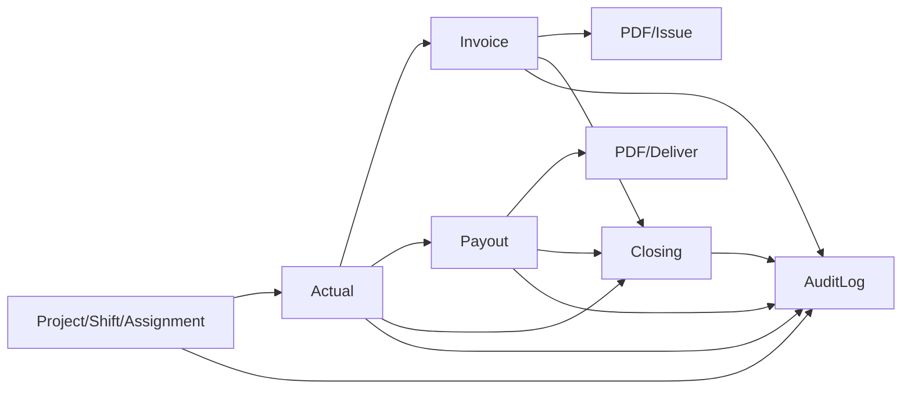

# architecture.md

## 1. システムの目的
本システムは、案件・シフト・実績・請求・支払を一元管理し、月次運用を「担当者依存」から「再現可能な標準業務」へ移すことを目的とする。

設計思想の中核は以下。
- 再現性: 金額計算と時間計算の結果をスナップショットとして保存し、後から同じ結果を再現できること
- 非破壊: 物理削除より論理無効化・版管理を優先し、監査可能性を維持すること
- 段階移行: 既存運用（Kintone）を即時置換せず、API/DB資産を活かして画面層を段階的に自前化すること

## 2. 想定利用者
- admin: 全体管理、マスタ管理、監査、締め解除など高権限業務
- ops: 案件運用、シフト/アサイン、CSV取込、請求/支払生成
- accounting: 請求発行、支払承認、締め処理
- site_manager: 担当案件の参照・提出系業務
- worker: スタッフ向けモバイル導線（予定返信、打刻、可否、経費）

## 3. 主要機能一覧
- 実績CSV取込（replace_scope / 二重化防止 / エラー差戻し）
- 時間計算（丸め、休憩、深夜）
- 単価解決と実績スナップショット
- 請求書・支払明細生成（版管理、PDF、送信履歴）
- 締め（Soft/Hard）と解除ガードレール
- 監査ログ検索
- スタッフ向け運用（予定返信、打刻、可否、経費、通知）

## 4. 機能同士の関係
1. 運用データ起点: 案件/シフト/アサイン
2. 実績確定: CSV取込や打刻で actual を作成
3. 計算確定: 時間計算 + 単価適用結果を actual に保存
4. 帳票生成: actual を正本に invoice / payout を生成
5. 発行・送信: PDF保存、支払送信履歴を記録
6. 統制: closing と audit_log で改変ガードと追跡

## 5. ディレクトリ構成（役割中心）
- src/models: ドメインモデルと整合性制約の中心
- src/services: 業務ルールの実装（CSV/計算/請求/支払/締め/監査）
- src/api: FastAPIエンドポイントと認証・スキーマ
- alembic: スキーマ進化履歴（設計判断の痕跡）
- apps/admin-web: 管理者向けWeb UI
- apps/staff-mobile: スタッフ向けモバイルWeb UI
- docs: 仕様・決定ログ・運用手順（設計の正本群）
- storage: 現在のファイル保存先（PDF/領収書など）

## 6. フロントエンド構成
### 6.1 アプリ分離
- admin-web: 管理業務の全体導線
- staff-mobile: worker専用導線

### 6.2 実装パターン
- ルーティング: React Router
- データ取得: TanStack Query
- APIアクセス: 各アプリの lib/api/client.ts で共通処理（認証ヘッダ、401時イベント）
- 認証状態: auth-context で localStorageトークン復元 + /api/auth/me
- 権限制御:
  - admin-web: ProtectedRoute + PermissionRoute
  - staff-mobile: ProtectedRoute + WorkerOnlyRoute

### 6.3 UI設計思想
- 画面を「参照系→運用系→登録系」の段階で拡張
- 一覧画面は DataTable + FilterBar + Pagination の共通骨格
- month/period_key を軸に、月次運用の再現性を担保

## 7. バックエンド構成
- フレームワーク: FastAPI
- レイヤ分離:
  - API層: 入出力、認証、権限、HTTPエラー
  - Service層: ドメインルール
  - Model層: スキーマ/制約
- 例外方針: カスタム例外（VANZAIException系）をAPI層でJSON化

## 8. 認証方式
- JWT Bearer（access token中心）
- ログイン: POST /api/auth/token
- セッション復元: GET /api/auth/me
- 失効時: フロント側で unauthorized イベントを受けてログイン画面へ戻す

## 9. 権限管理
- RBAC（role + permission）
- ROLE_PERMISSIONS で権限集合を定義
- check_permission / require_permission でサーバー側強制
- 画面側もルートをロール制限（ただし最終防衛線はAPI）

## 10. 通知処理
- メール通知: テンプレート生成 + 送信サービス + scheduler
- スタッフ通知: staff_notices / staff_notice_reads
- プッシュ通知: push_subscriptions 管理 + VAPID公開鍵API
- 予定返信監視: reminder / escalation の履歴と監査を保持

## 11. ファイル管理方式
- 現在: ローカル storage 配下に保存
- 抽象化: ObjectStorage で object key 契約を統一
- 方針: 保存先をR2等に置換しても呼び出し側の設計を崩さない
- 代表キー:
  - invoices/{period}/invoice_{id}_v{version}.pdf
  - payouts/{period}/payout_{id}_v{version}.pdf
  - receipts/{yyyymm}/expense_{id}.{ext}

## 12. 横展開できる共通パターン
- 1. 二層ガード認可
  - フロントガード + API権限チェック
- 2. スナップショット会計
  - 明細行を正本、合計は集計値
- 3. 非破壊更新
  - canceled / invalid / superseded / version 管理
- 4. 月次キー中心設計
  - period_key による運用単位の固定
- 5. 送信履歴を業務エンティティとして保存
  - deliver結果を履歴化し再送可能にする

## 13. 実装状況サマリ（コード照合 2026-06-10）

| 領域 | 状態 | 備考 |
|------|------|------|
| コア会計フロー | ✅ 実装済み | actuals → invoice/payout、版管理 |
| CSV replace_scope | ✅ 実装済み | append/upsert は未実装 |
| 締め API | ✅ 実装済み | `/api/closing/*` が正本 |
| 締め×取込/帳票連携 | ❌ 未連携 | 再計算のみ Hard Close ガード |
| 公開登録フォーム | ✅ 実装済み | `/public/registrations/*` |
| スタッフモバイル | ✅ 7画面 | worker 専用 |
| admin-web | ✅ 20+ルート | ロール別 PermissionRoute |
| API エンドポイント | 100 EP | `main.py` モノリシック |
| Phase1E（tasks/sales_reports） | ⚠️ migration のみ | ORM なし |
| 貸出備品・振込バッチ | ❌ 未整備 | Kintone / サービスのみ |
| DESIGN_SPEC 正本 | ⚠️ 復元たたき台 | `docs/spec/DESIGN_SPEC_v0.3.md` |

詳細ギャップ: `project-docs/CODE_VERIFIED_GAPS.md`

## 14. admin-web ルート一覧（参考）

| パス | ページ | ロール |
|------|--------|--------|
| /dashboard | DashboardPage | admin, ops, accounting, site_manager |
| /operations/csv-import | CsvImportPage | + site_manager |
| /operations/actuals | ActualsPage | 上記4ロール |
| /operations/assignments | AssignmentsPage | 上記4ロール |
| /operations/projects | ProjectsPage | 上記4ロール |
| /billing/invoices | InvoicesPage | admin, ops, accounting |
| /billing/payouts | PayoutsPage | admin, ops, accounting |
| /masters/* | マスタ系 | 参照は site_manager 可、編集は admin |
| /audit-logs | AuditLogsPage | admin, ops, accounting |
| /public/registrations/:formType | PublicRegistrationPage | 公開 |

## 15. 要確認
- DBの正本運用はドキュメント上 PostgreSQL 前提だが、ローカルでは SQLite 記述も併存しているため、移植時は環境別差分の扱いを要確認
- Kintoneとの最終的な責務分離（停止/参照専用化の確定タイミング）は要確認
- 締めガードのサービス層統合（`CODE_VERIFIED_GAPS.md` G-001, G-002）
