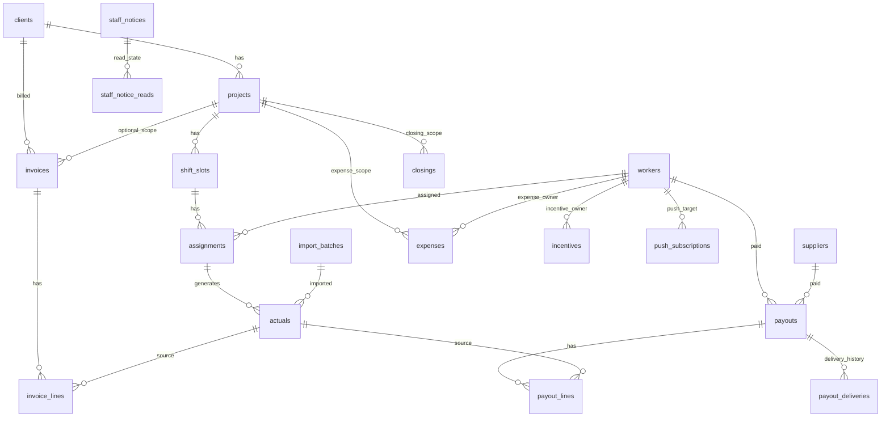

# database_design.md

## 1. DB種別
- 設計/本番想定: PostgreSQL
- 開発ローカル: SQLite 運用履歴あり

補足:
- コード上はDB方言をなるべく抽象化しているが、migration運用で方言差が発生する箇所がある。

## 2. テーブル一覧（役割分類）
### 2.1 認証・ユーザー
- users

### 2.2 マスタ
- workers
- worker_availability_preferences
- worker_bank_accounts
- suppliers
- supplier_bank_accounts
- clients
- client_staff
- vanzai_staff
- sites
- project_types
- roles
- price_sales
- price_outsource
- price_rules
- incentive_rules

### 2.3 申請・登録補助
- registration_requests
- worker_registration_request_details
- supplier_individual_request_details
- supplier_corporation_request_details
- introducer_identity_request_details
- registration_request_files

### 2.4 取引・運用トランザクション
- projects
- shift_slots
- assignments
- import_batches
- actuals
- assignment_selection_sets
- invoices
- invoice_lines
- payouts
- payout_lines
- payout_deliveries
- closings
- expenses
- worker_availability
- incentives

### 2.5 監査・通知
- audit_logs
- staff_notices
- staff_notice_reads
- push_subscriptions

## 3. 各テーブルの役割（要約）
- actuals: 計算・単価のスナップショットを保持する会計上の基礎テーブル
- invoices / invoice_lines: 請求の版管理と明細正本
- payouts / payout_lines / payout_deliveries: 支払と送信運用の正本
- closings: 期間確定状態と解除履歴のガードレール
- audit_logs: 変更追跡と証跡
- import_batches: CSV投入の再現性・差分管理

## 4. 主キー
- 原則: String(26) ULID を主キーとして採用
- 例外: なし（主要ドメインテーブルはULID統一）

## 5. 外部キー（主要）
- projects.client_id -> clients.id
- shift_slots.project_id -> projects.id
- assignments.shift_slot_id -> shift_slots.id
- assignments.worker_id -> workers.id
- actuals.assignment_id -> assignments.id
- actuals.import_batch_id -> import_batches.id
- invoices.client_id -> clients.id
- invoice_lines.invoice_id -> invoices.id
- payouts.worker_id -> workers.id
- payouts.supplier_id -> suppliers.id
- payout_lines.payout_id -> payouts.id
- payout_deliveries.payout_id -> payouts.id
- closings.project_id -> projects.id
- expenses.project_id -> projects.id
- expenses.target_invoice_id -> invoices.id
- expenses.target_payout_id -> payouts.id
- incentives.incentive_rule_id -> incentive_rules.id
- incentives.target_invoice_id -> invoices.id
- incentives.target_payout_id -> payouts.id
- staff_notice_reads.notice_id -> staff_notices.id
- push_subscriptions.worker_id -> workers.id

## 6. リレーション図（主要業務フロー）

## 7. 論理削除の有無
- あり（SoftDeleteMixin）
- deleted_at を持つテーブルで論理削除を優先
- 実績系は deleted_at だけでなく status も使い分ける
  - assignments.status = canceled
  - actuals.status = active/invalid/superseded

## 8. 監査ログの有無
- あり（audit_logs）
- 重要操作（取込、締め、発行、送信、取消、再計算等）をイベントとして記録

## 9. 重要な設計判断
- 1. スナップショット優先
  - actuals に計算結果と単価を固定保存
- 2. 非破壊訂正
  - invoice/payout は version と親子参照で管理
- 3. 月次運用単位
  - period_key (YYYYMM) を横断キーに採用
- 4. 締めガード
  - Soft/Hard close + release_count + deadline
- 5. 送信履歴のドメイン化
  - payout_deliveries で再送・追跡を可能化

## 10. 移植時の観点
- ULID主キー戦略は他案件でも再利用しやすい
- period_key 主導の月次業務モデルは請求/支払系で汎用性が高い
- status + soft delete + version の三段保全は会計系に有効

## 11. コード照合で追記（2026-06-10）

### 11.1 Alembic HEAD
- 最新 revision: `20260409a001_add_invoice_issue_metadata`
- revision 総数: 35

### 11.2 migration のみ（ORM 未定義）
`20260408e001` で作成、`src/models/` にクラスなし:
- `project_type_documents`
- `task_templates`
- `project_tasks`
- `sales_reports`

### 11.3 ドキュメント未記載の主要カラム
- `invoices`: document_type, invoice_subject, addressee_*, fixed_office_fee_amount（20260409a001）
- `payouts`: recipient_type, recipient_id, payee_name_snapshot, bank/tax JSON（20260408d001）
- `project_types`: category_level, parent_id（階層、20260408c001）
- `vanzai_staff`: linked_worker_id, playing_manager_fee_*（20260408f/g）
- `assignments`: worker_response_status/at/note
- `staff_notices`: push_action_type
- `users`: vanzai_staff_id, display_name（worker_id と排他 CHECK）

### 11.4 payout recipient（DEC-019）
- 正本: `recipient_type` + `recipient_id`（worker / supplier / vanzai_staff）
- legacy: `worker_id` / `supplier_id` も併存（xor はアプリ層）

### 11.5 `src/models/__init__.py` export 不足
41 テーブル定義あるが export は 14 クラスのみ。直接 import が必要。

## 12. 要確認
- 最新マイグレーションheadと本番DB実体の差分（運用中の追加revisionを含む）は要確認
- registration系テーブルの運用必須度（全案件で必要か）は要確認
- Phase1E 4テーブルの ORM/API 実装予定
